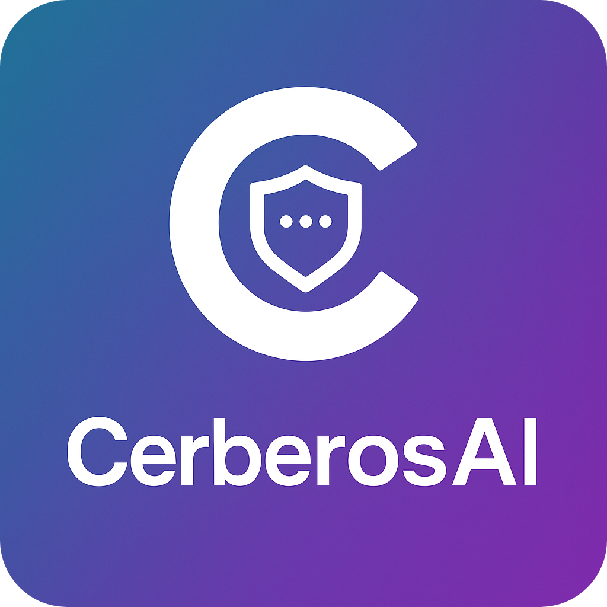
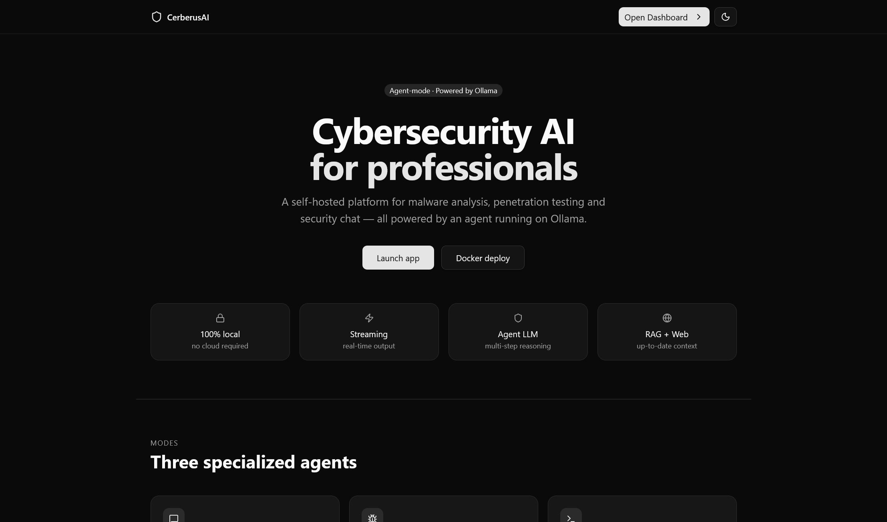
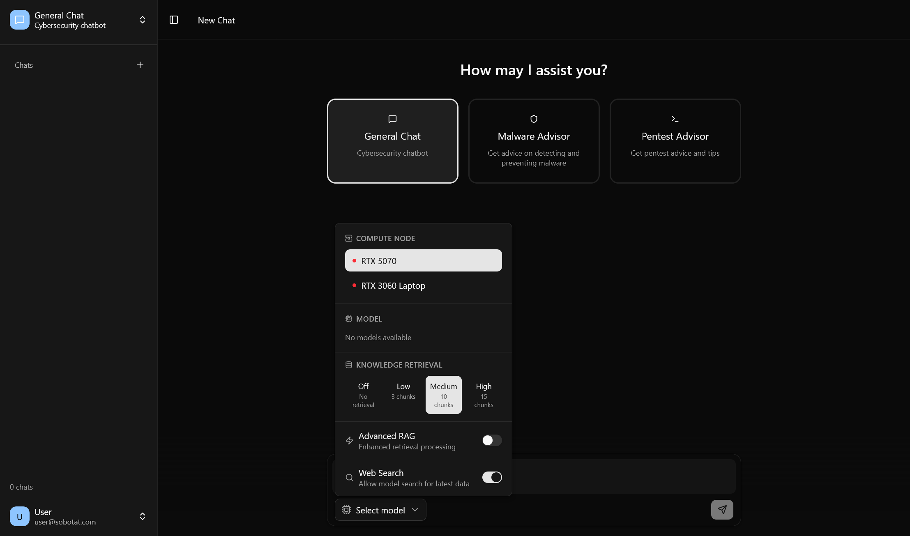

<p align="center">
  <picture>
    
  </picture>
  <br />
  <strong>Cerberus AI</strong>
  <em> - Cybersecurity AI</em>
</p>

A modern React-based web application for AI-powered chat conversations. Part of a master's thesis project.

## Overview

Cerberus AI provides an intuitive interface for communicating with AI language models. Built with React and Vite, it offers a rich set of features for seamless AI interactions.

## Features

| Feature | Description |
|---------|-------------|
| 💬 **AI Chat** | Conversations with multiple language model support |
| 📚 **Multi-Chat** | Manage multiple conversations simultaneously |
| 🔄 **Mode Switching** | Switch between different chat modes (Chat, Code, etc.) |
| 🔍 **RAG Integration** | Retrieval-Augmented Generation with adjustable levels |
| 🌐 **Web Search** | Integration with external knowledge sources |
| 📄 **PDF Export** | Share and export conversations as PDF documents |
| 🌓 **Dark/Light Theme** | Full theme support with system preference detection |
| 👨‍💼 **Admin Dashboard** | User management and compute node administration |

## Tech Stack

| Category | Technology |
|----------|------------|
| **Framework** | React 19 |
| **Routing** | React Router 7 |
| **Build Tool** | Vite 7 |
| **Styling** | Tailwind CSS 4 |
| **UI Components** | Radix UI |
| **Language** | TypeScript |
| **Validation** | Zod |
| **Forms** | React Hook Form |

## Project Structure

```
src/
├── components/       # Reusable UI components (Button, Dialog, Sidebar, etc.)
├── hooks/            # Custom React hooks
├── lib/              # Utilities and API configuration
├── routes/           # Application routes/pages
│   ├── dashboard/    # Main chat interface
│   ├── admin_dashboard/ # Admin panel
│   ├── login/        # Authentication
│   └── ...
├── states/           # React Context (Auth, Theme)
└── types/            # TypeScript type definitions
```

## Prerequisites

- Node.js 18 or higher
- Cerberus AI Backend API

## Installation

```bash
npm install
```

## Available Scripts

| Command | Description |
|---------|-------------|
| `npm run dev` | Start development server |
| `npm run build` | Build for production |
| `npm run lint` | Run ESLint code analysis |
| `npm run preview` | Preview production build |

## Docker

### Build

```bash
docker buildx build --builder mybuilder --platform linux/amd64,linux/arm64 -t username/cerberus-ai --push .
```

### Run

```bash
docker run -d -p 80:80 -e CERBERUS_API_URL=<url-to-api> sobotat/cerberus-ai
```

### Docker Compose

```yaml
services:
  web:
    image: sobotat/cerberus-ai
    container_name: cerberus-ai
    restart: unless-stopped
    ports:
      - "80:80"
    environment:
      CERBERUS_API_URL: <url-to-api>
```

Usage:

```bash
docker-compose up -d
```

### Development

```bash
npm run dev
```

### Production Build

```bash
npm run build
npm run preview
```

## Configuration

### Development Mode

Create a `.env` file in the project root:

```env
CERBERUS_API_URL=http://localhost:8080
```

### Production Mode

The API URL is loaded from `window.APP_CONFIG.API_URL` at runtime.

## Application Features

### Chat Interface

- Select compute node and AI model
- Configure RAG level (low, medium, high)
- Switch between chat modes
- Chat history in sidebar
- Export conversations to PDF

### Admin Dashboard

- User management
- Compute node configuration
- System monitoring

### Authentication

- JWT-based authentication
- Protected routes with `ProtectedRoute`
- Role-based access control (user/admin)

## Screenshots




## License

Private project — Master's thesis.

